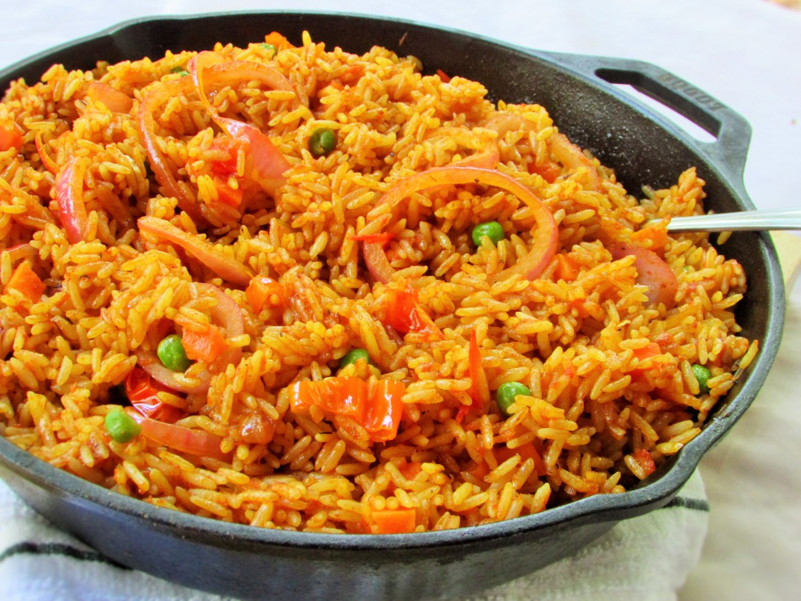

# Richmond Ampaabeng

This is my attempt at using Markdown and publishing it on Github
## Bio
### Me
**I was born in Ghana** but was raised in _England_. I am currently on the **_Rubik Talent_** training course. 

You will find attcahed my **LinkedIn** profile below to find out more about me and my experience
[LinedIn](https://www.linkedin.com/in/richmond-ampaabeng-735046171/)

## Favourite quote
> "The best and most beautiful things in the world cannot be seen or even touched - they must be felt with the heart."
###                             Helen Keller

I love food

## Favourite Food

**Jollof rice**

